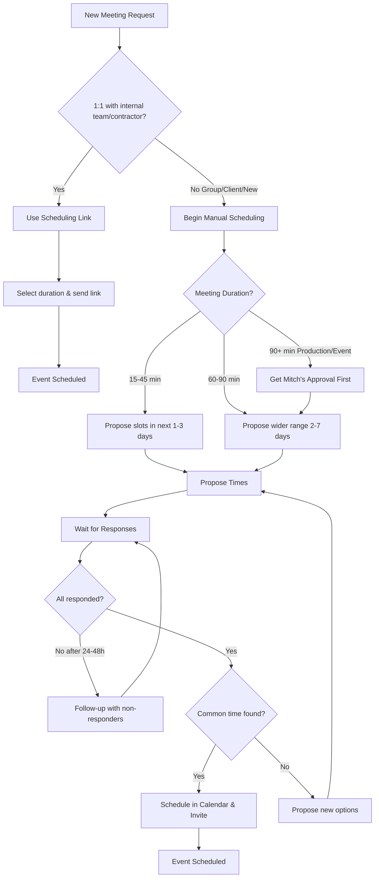

# Calendar SOP
# Calendar Scheduling SOP

This guide provides a step-by-step process for scheduling meetings efficiently. The core decision is whether to use an automated scheduling link or to coordinate manually.

## Unified Scheduling Workflow

## Step 1: Manual vs. Link-Based Scheduling

The first step is to determine the appropriate scheduling method.

### ✅ Use Meeting Links For:

- 1:1 meetings with contractors or freelancers
- Existing team members and internal collaborators
- Established working relationships

### ❌ Use Manual Scheduling For:

- Group meetings (3+ people)
- All client meetings
- First-time meetings with new contacts

## Step 2: The Scheduling Process

Follow the path determined in Step 1.

### Path A: Using a Scheduling Link

If the meeting fits the criteria, select the link that matches the required duration and send it to the contact.

- [15 minutes](https://calendar.notion.so/meet/mitchmetz/15)
- [30 minutes](https://calendar.notion.so/meet/mitchmetz/30)
- [45 minutes](https://calendar.notion.so/meet/mitchmetz/45)
- [90 minutes](https://calendar.notion.so/meet/mitchmetz/90)

### Path B: Manual Scheduling

For groups, clients, or new contacts, manual coordination is required.

**1. Determine Duration & Propose Times:**

- **Standard (15-45 min):** Offer specific 30-min slots over the next 1-3 days.
- **Extended (60-90 min):** Offer a wider range of options (specific slots or larger windows) spread out over the next week.
- **Production/Events (90+ min):** Requires Mitch's approval before proposing times.
- **For larger groups,** offer fewer, more varied options (e.g., one specific slot, one larger window on another day, and a third option).

**2. Communication Guidelines:**

- **Core Hours:** Prioritize suggesting times between **1:30 PM - 4:30 PM** on weekdays.
- **Be Specific:** Propose varied, concrete time slots (e.g., "Monday at 2:30 PM or Tuesday at 3:00 PM"). Avoid vague statements like "I'm free in the afternoon."
- **Weekends:** Only suggest weekend availability for freelancers.

**3. Follow-Up and Confirmation:**

- **Wait for Responses:** Allow 24-48 hours for participants to respond.
- **Follow Up:** If needed, send a follow-up to non-responders, referencing the times that work for others.
- **Confirmation:** Once a common time is found, schedule the event and send the invitation. If no time works, propose a new set of options.

## General Guidelines

### Calendar Management

When scheduling, check the following calendars for conflicts:

- **Mitch Metz:** mitch@rowan.build (Primary)
- [mitchmetz.com](http://mitchmetz.com/): [mitch@mitchmetz.com](mailto:mitch@mitchmetz.com)
- Time Blocking: `e5ceaa...`
- Unavailability: `c_22d5...`
- metzmitchell: [metzmitchell@gmail.com](mailto:metzmitchell@gmail.com)
- Family Plans: `71aab...`

### Key Principles

- **Efficiency:** Most value comes from focused discussion in 15-45 minutes.
- **Clarity:** If uncertain about duration, ask Mitch for clarification.
- **Flexibility:** In-person meetings can include additional topics from other threads.
- **Remote Default:** All meetings are remote via Google Meet unless specified otherwise.